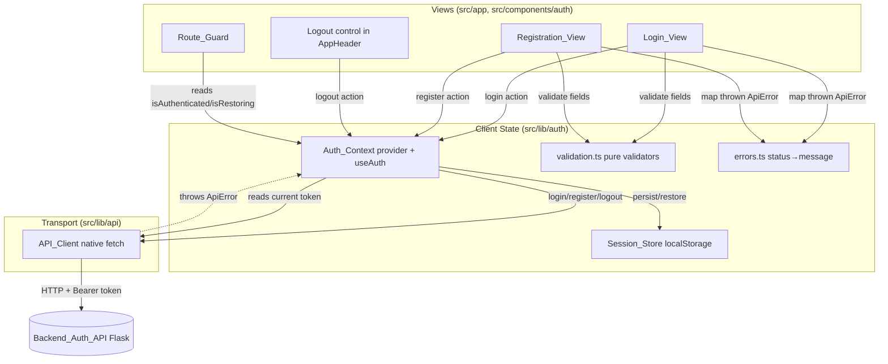
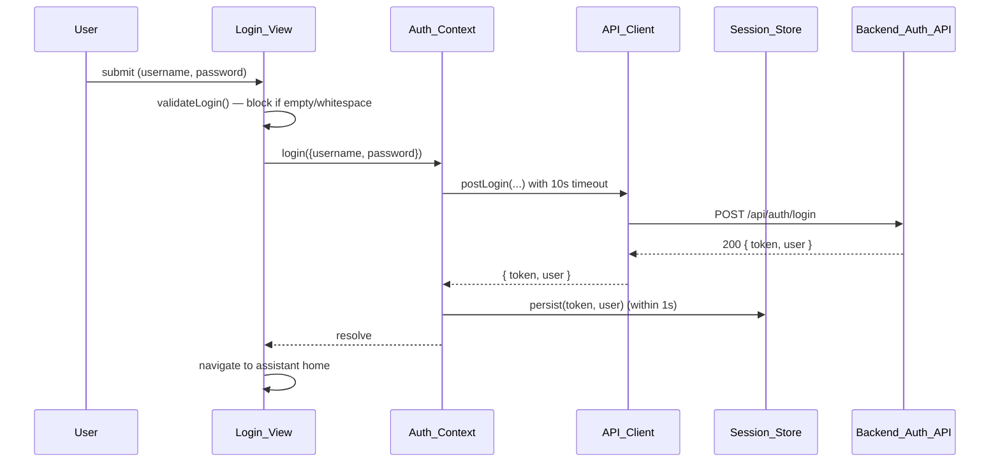

# Design Document: Auth Views

## Overview

This feature adds the frontend authentication experience to the existing Next.js App Router application (`botfront`): a Login_View, a Registration_View, a shared Auth_Context provider backed by a `localStorage` Session_Store, a client-side Route_Guard for Protected/Public routes, a logout control in the application header, and the API_Client methods that talk to the already-implemented Flask auth endpoints.

The design deliberately reuses the conventions already proven in the codebase:

- **One HTTP entry point.** All auth traffic flows through the single typed `apiClient` in `src/lib/api/client.ts` using native `fetch`. The existing `ApiError` (carrying HTTP `status` + `message`) is the error currency. The client accepts an HTTP status only in the explicit `200-299` range, throws `ApiError` for any out-of-range status, and throws `ApiError("invalid response")` when an in-range response body is malformed or (for login) missing the token or user (Requirement 7.1, 7.2, 7.4, 7.7). No Axios, no TanStack Query, no new HTTP dependency (Requirement 7.8).
- **Context-only cross-cutting state.** `Auth_Context` mirrors the structure of the existing `PreferencesProvider` (`src/lib/preferences.tsx`): a `"use client"` provider, `useState` + `useEffect` hydration from `localStorage`, a memoized context value, and a `useAuth()` hook. It is persisted to `localStorage` for continuity across reloads (Requirement 8, mirrors the Preferences pattern called out in the Introduction).
- **Established UI conventions.** Views are App Router pages/components styled with the semantic Theme_Token utilities (`bg-surface`, `text-text`, `border-border`, `text-error`, etc.), localized through the existing `useT()` bilingual dictionary, and mirror for Arabic via the `dir` attribute already managed by `PreferencesProvider`.

Because the backend endpoints already exist and a successful login/register returns `{ token, user }`, this spec covers only the frontend UI/UX and its integration.

The document is organized into a **High-Level Design** (architecture, component responsibilities, data models, data-flow diagrams) and a **Low-Level Design** (function signatures, algorithms, and pseudocode for each module), followed by Correctness Properties, Error Handling, and the Testing Strategy.

### Backend contract (assumed, not modified)

| Endpoint | Success | Body | Notable failures |
| --- | --- | --- | --- |
| `POST /api/auth/login` | 200-299 | `{ token, user }` | 401 invalid credentials, 400 bad data, malformed/partial 2xx body |
| `POST /api/auth/register` | 200-299 (201) | `{ user }` (created account) | 409 already exists, 400 bad data, 500+ |
| `POST /api/auth/logout` | 2xx | (no meaningful body) | any failure → client clears session anyway |

`user` is `{ id, username, email, role }` at minimum (Glossary: Authenticated_User). The API_Client treats success as the entire `200-299` range, not the single nominal code (Requirement 7.1, 7.2). A `200` login whose body is missing the `token` or the `user` is treated as a failure — the client throws `ApiError("invalid response")` rather than returning a half-session (Requirement 1.9, 7.7), which the Login_View surfaces as a generic "request could not be completed" message (Requirement 1.8, 1.9).

---

# High-Level Design

## Architecture

### Module map

```
src/
├── app/
│   ├── layout.tsx                 # mounts <PreferencesProvider><AuthProvider>…
│   ├── (auth)/
│   │   ├── login/page.tsx         # Login_View   (Public_Route)
│   │   └── register/page.tsx      # Registration_View (Public_Route)
│   ├── page.tsx                   # assistant home (Protected_Route)
│   └── settings/page.tsx          # settings      (Protected_Route)
├── components/
│   ├── auth/
│   │   ├── LoginForm.tsx          # presentational + validation wiring
│   │   ├── RegisterForm.tsx
│   │   ├── AuthErrorAlert.tsx     # ARIA live region for Auth_Error_Message
│   │   └── RouteGuard.tsx         # Protected/Public gate
│   └── AppHeader.tsx              # + LogoutButton (extended)
└── lib/
    ├── auth/
    │   ├── context.tsx            # Auth_Context provider + useAuth()
    │   ├── session-store.ts       # localStorage persistence + (de)serialization
    │   ├── validation.ts          # pure field validators (login + register)
    │   └── errors.ts              # ApiError → Auth_Error_Message mapping
    ├── api/client.ts              # + login()/register()/logout() + auth header
    ├── preferences.tsx            # (existing) + new auth dictionary entries
    └── types/index.ts             # + AuthUser, AuthSession, auth payload types
```

### Layered responsibility



The key architectural decision: **the views never call `fetch` or the API_Client directly for auth.** They call `auth.login(...)`, `auth.register(...)`, `auth.logout()` on the context. The context owns the call, owns the session mutation, and re-throws `ApiError` so the view can map it to a localized message. This keeps a single source of truth (Requirement 8.5) and keeps session writes atomic with the network result (Requirement 8.3, 8.7).

### Provider mounting

`AuthProvider` is mounted in `layout.tsx` directly inside `PreferencesProvider`, so every view, the Route_Guard, and the AppHeader can read the session (Requirement 8.5). The Route_Guard is rendered per-layout-group so it can branch on route class (Protected vs Public).



## Components and Interfaces

### Auth_Context (`lib/auth/context.tsx`)
Owns session state and exposes actions. Mirrors `PreferencesProvider`:
- State: `token: string | null`, `user: AuthUser | null`, `status: "restoring" | "ready"`, `persistError: boolean`.
- Derived: `isAuthenticated = token !== null && user !== null` — the boolean authentication status exposed to every consumer (Requirement 4.4, 8.2).
- Actions: `login`, `register`, `logout`.
- Hydration: a mount `useEffect` reads the Session_Store, validates it, and either restores or clears it; restoration completes (status flips to `ready`) before any consumer renders Protected content because the Route_Guard gates on `status` (Requirement 8.1, 8.8, 8.9, 4.2, 4.7).
- Persistence: writes through the Session_Store on every successful login; clears on logout (Requirement 4.1, 8.3, 8.4).

### Session_Store (`lib/auth/session-store.ts`)
Pure-ish persistence helpers wrapping `localStorage`: `readSession`, `writeSession`, `clearSession`, plus the `serializeSession` / `parseSession` pair that the round-trip property targets. Handles unavailable/quota-exceeded `localStorage` by signaling failure rather than throwing (Requirement 4.6), and treats missing/empty/malformed records as "no session" (Requirement 4.7). A **partial** record — a token with no complete user, or a user with no non-empty token — is likewise rejected (parsed to `null`) and removed, so the provider starts unauthenticated (Requirement 8.9).

### Validation (`lib/auth/validation.ts`)
Pure functions returning a structured result of per-field errors. No React, no I/O — the prime target for property-based testing. Covers trimming, length bounds, and the email pattern (Requirements 1.5, 2.5–2.7).

### Errors (`lib/auth/errors.ts`)
Pure `ApiError → Auth_Error_Message key` mapper implementing the status table in Requirement 3 (401→invalid credentials, 409→already exists, 400 with/without body, other non-2xx→include status, network→network message; 400 body truncated to 200 chars).

### Login_View / Registration_View (`components/auth/*Form.tsx`, `app/(auth)/*`)
Client components holding form field state, the pending flag, and the current error. They call validators before submit, call the context action, and render `AuthErrorAlert` in a live region. Validation reports **every** offending field, not just the first (Requirements 2.5, 2.6). Password inputs use `type="password"` and enforce the upper length bound with `maxLength` (the login password input rejects input beyond 254 characters per Requirement 1.1; masking per Requirements 1.10, 2.10). On a non-200/non-auth-failure response or a malformed 200 (missing token/user), the Login_View shows a generic "request could not be completed" message (Requirements 1.8, 1.9). Each provides a navigation control to the other view that performs the navigation when activated (Requirements 1.11, 2.11, 2.12).

### Route_Guard (`components/auth/RouteGuard.tsx`)
Reads `auth.status` and `auth.isAuthenticated`. While `restoring`, shows a loading indicator (max 5s) and renders **no** Protected_Route content (no content leak). For Protected_Routes it redirects unauthenticated users to login within 100ms, preserving the requested path **including its query string** so it can be restored after login. For Public auth routes it redirects authenticated users to home within 100ms. After a successful login it redirects to the retained path (clearing it) when present, otherwise to the assistant home (Requirement 5, including 5.1, 5.5, 5.6, 5.7).

### AppHeader logout control
Extends the existing header with a `LogoutButton` rendered only while authenticated; disabled during an in-flight logout (Requirement 6.1–6.3). Because visibility is derived from `isAuthenticated`, navigating to the Login_View after a logout (when the session is cleared) removes the control from the header (Requirement 6.6).

### Interface summary

| Consumer | Reads | Calls |
| --- | --- | --- |
| Login_View | `isAuthenticated` | `login()` |
| Registration_View | – | `register()` |
| Route_Guard | `status`, `isAuthenticated` | – |
| AppHeader | `isAuthenticated`, `user` | `logout()` |
| API_Client | current `token` (injected) | – |

## Data Models

```typescript
// lib/types/index.ts (additions)

/** Authenticated_User — the account returned in the `user` field. */
export type AuthUser = {
  id: string | number;
  username: string;
  email: string;
  role: string;
};

/** The active session held by Auth_Context and persisted to Session_Store. */
export type AuthSession = {
  token: string;       // Access_Token (JWT), non-empty
  user: AuthUser;      // complete Authenticated_User
};

/** Request payloads. */
export type LoginPayload = { username: string; password: string };
export type RegisterPayload = { username: string; email: string; password: string };

/** Success result of register: the created account (no session change). */
export type RegisterResult = { user: AuthUser };

/** Per-field validation outcome (pure validators). */
export type FieldErrorKey =
  | "username.required" | "username.length"
  | "email.required"    | "email.format"
  | "password.required" | "password.length";

export type ValidationResult =
  | { ok: true }
  | { ok: false; errors: FieldErrorKey[] };

/** Context-exposed action outcome (never throws to the caller's await site
 *  for control flow we still re-throw ApiError; this models success data). */
export type AuthContextValue = {
  token: string | null;
  user: AuthUser | null;
  isAuthenticated: boolean;
  status: "restoring" | "ready";
  persistError: boolean;
  login: (payload: LoginPayload) => Promise<void>;
  register: (payload: RegisterPayload) => Promise<RegisterResult>;
  logout: () => Promise<void>;
};
```

### Validation bounds (single source of truth)

| Field | View | Min | Max | Extra |
| --- | --- | --- | --- | --- |
| username | Login | 1 (trimmed) | 254 | non-whitespace |
| password | Login | 1 (trimmed) | 254 | non-whitespace |
| username | Register | 1 (trimmed) | 150 | non-whitespace |
| email | Register | 1 (trimmed) | 254 | matches email pattern |
| password | Register | 8 | 128 | (not trimmed for length) |

Email pattern (Requirement 2.2): at least one char before `@`, at least one char between `@` and a `.` in the domain, at least one char after that `.`. Implemented as `/^[^@\s]+@[^@\s.]+\.[^@\s]+$/`.

---

# Low-Level Design

This section gives the concrete signatures, algorithms, and pseudocode for each module. TypeScript signatures are normative; bodies are illustrative pseudocode that the implementation tasks will realize.

## 1. Session_Store — `lib/auth/session-store.ts`

```typescript
const STORAGE_KEY = "mgb-auth";   // mirrors the "mgb-*" key convention in preferences.tsx

/** Serialize a session to the exact JSON string persisted to localStorage. */
export function serializeSession(session: AuthSession): string;

/** Parse a stored string back into a session, or null when missing/empty/malformed. */
export function parseSession(raw: string | null): AuthSession | null;

/** Read + validate the persisted session. Never throws. */
export function readSession(): AuthSession | null;

/** Persist a session. Returns false when localStorage is unavailable / quota-exceeded. */
export function writeSession(session: AuthSession): boolean;

/** Remove any persisted session. Never throws. */
export function clearSession(): void;
```

### `parseSession` algorithm (Requirement 4.7, 8.8)

```
function parseSession(raw):
    if raw is null or raw.trim() == "": return null
    try: obj = JSON.parse(raw)
    catch: return null
    if obj is not an object: return null
    token = obj.token
    user  = obj.user
    if typeof token != "string" or token.length == 0: return null
    if not isCompleteUser(user): return null      # id, username, email, role all present & correct type
    return { token, user }

function isCompleteUser(u):
    return u is object
        and (typeof u.id == "string" or typeof u.id == "number")
        and typeof u.username == "string" and u.username.length > 0
        and typeof u.email    == "string" and u.email.length > 0
        and typeof u.role     == "string"
```

`serializeSession(session)` is exactly `JSON.stringify({ token: session.token, user: session.user })`. Together these give the round-trip guarantee `parseSession(serializeSession(s)) ≡ s` for any valid session (Property 1).

### `writeSession` algorithm (Requirement 4.6)

```
function writeSession(session):
    try:
        localStorage.setItem(STORAGE_KEY, serializeSession(session))
        return true
    catch (e):                  # SecurityError (unavailable) or QuotaExceededError
        return false            # caller keeps the in-memory session and flags persistError
```

## 2. Validation — `lib/auth/validation.ts`

```typescript
const EMAIL_RE = /^[^@\s]+@[^@\s.]+\.[^@\s]+$/;

export function validateLogin(input: LoginPayload): ValidationResult;
export function validateRegister(input: RegisterPayload): ValidationResult;

/** Helpers (exported for unit tests). */
export function isBlank(value: string): boolean;          // trim().length === 0
export function isValidEmail(value: string): boolean;     // EMAIL_RE.test(trimmed)
```

### Algorithms (Requirements 1.5, 2.5–2.7)

```
function validateLogin({username, password}):
    errors = []
    if isBlank(username): errors.push("username.required")
    else if username.trim().length > 254: errors.push("username.length")
    if isBlank(password): errors.push("password.required")
    else if password.trim().length > 254: errors.push("password.length")
    return errors.empty ? {ok:true} : {ok:false, errors}

function validateRegister({username, email, password}):
    errors = []
    u = username.trim()
    if u.length == 0: errors.push("username.required")
    else if u.length < 1 or u.length > 150: errors.push("username.length")

    if isBlank(email): errors.push("email.required")
    else if not isValidEmail(email): errors.push("email.format")

    if password.length == 0: errors.push("password.required")
    else if password.length < 8 or password.length > 128: errors.push("password.length")

    return errors.empty ? {ok:true} : {ok:false, errors}
```

Note: a valid submission produces `{ok:true}` and an invalid one produces `{ok:false}` with at least one error — these two are exact complements over the input space (Property 2, Property 3).

## 3. Error mapping — `lib/auth/errors.ts`

```typescript
export type AuthErrorView = "login" | "register";

/** Maps a thrown ApiError (or network failure) to a localized message key + params. */
export function mapAuthError(
  error: unknown,
  view: AuthErrorView,
): { key: string; status?: number; detail?: string };
```

### Algorithm (Requirement 3.1–3.6, 7.4–7.6)

```
function mapAuthError(error, view):
    if error is not ApiError:                      # network / no HTTP status (R3.5, 7.6)
        return { key: "auth.error.network" }
    switch error.status:
        case 401: return { key: "auth.error.invalidCredentials" }     # R3.1
        case 409: return { key: "auth.error.alreadyExists" }          # R3.2
        case 400:
            detail = error.message?.trim() ?? ""
            if detail.length > 0:
                return { key: "auth.error.badRequestDetail",
                         detail: detail.slice(0, 200) }                # R3.3 (truncate 200)
            return { key: "auth.error.invalidData" }                  # R3.4
        default:                                                       # any other non-2xx
            return { key: "auth.error.status", status: error.status } # R3.6
```

The mapping is **total**: every `unknown` input yields exactly one branch (Property 4).

## 4. API_Client additions — `lib/api/client.ts`

A token accessor is injected so the client can attach `Bearer <token>` without importing React (keeps the transport layer framework-free). The Auth_Context registers the accessor on mount.

```typescript
// Token provider wiring — set by Auth_Context, read on every request.
let getToken: () => string | null = () => null;
export function setAuthTokenProvider(fn: () => string | null): void { getToken = fn; }

/** Build headers, attaching Authorization only when a token is present. */
function authHeaders(base: Record<string, string> = {}): Record<string, string> {
  const token = getToken();
  return token ? { ...base, Authorization: `Bearer ${token}` } : { ...base };
}

/** fetch with an AbortController timeout; rethrows as ApiError on network/timeout. */
async function fetchJson<T>(
  path: string,
  init: RequestInit,
  timeoutMs: number,
): Promise<T>;

export const apiClient = {
  // …existing postChat / postRating…

  /** R7.1 — POST /api/auth/login, 10s timeout; on any 200-299 returns { token, user }
   *  parsed from the body, else throws ApiError (out-of-range status, network, or
   *  an invalid/partial 2xx body missing token or user). */
  login(payload: LoginPayload, timeoutMs = 10_000): Promise<AuthSession>,

  /** R7.2 — POST /api/auth/register, 30s timeout; on any 200-299 returns the created
   *  account parsed from the body, else throws ApiError. */
  register(payload: RegisterPayload, timeoutMs = 30_000): Promise<RegisterResult>,

  /** R7.3, 6.2 — POST /api/auth/logout with Bearer token, 10s timeout. */
  logout(timeoutMs = 10_000): Promise<void>,
};
```

### `fetchJson` algorithm (Requirements 4.3, 4.8, 7.1–7.7)

```
async function fetchJson(path, init, timeoutMs, parse):
    controller = new AbortController()
    timer = setTimeout(() => controller.abort(), timeoutMs)   # R7.6 (up to 30s)
    try:
        res = await fetch(BASE_URL + path, { ...init,
                  headers: authHeaders(init.headers), signal: controller.signal })
    catch (e):
        # abort (timeout) or network failure → no HTTP status received (R7.6)
        throw new ApiError(0, "network")            # status 0 == network sentinel
    finally:
        clearTimeout(timer)

    if res.status < 200 or res.status > 299:        # explicit out-of-range (R7.4, 7.5)
        message = await readErrorMessage(res)       # body.error/message or ""
        throw new ApiError(res.status, message || `HTTP ${res.status}`)

    # In-range (200-299): parse + validate the body (R7.1, 7.2, 7.7)
    if res.status == 204: body = undefined
    else:
        try: body = await res.json()
        catch: throw new ApiError(res.status, "invalid response")   # malformed body (R7.7)
    return parse(body)        # parse throws ApiError(status,"invalid response") on bad shape
```

Each auth method passes a `parse` validator: `login` requires a non-empty string `token` **and** a complete `AuthUser` (else `ApiError(status, "invalid response")`, satisfying R1.9, R7.7); `register` requires a complete `user`; `logout` ignores the body. `authHeaders` attaches `Authorization` iff a token is present — satisfying "include Bearer while token held" (R4.3) and "omit while no token" (R4.8) as exact complements (Property 8). The `ApiError(0, "network")` sentinel is treated by `mapAuthError` as "not a status-bearing error" → network message.

## 5. Auth_Context — `lib/auth/context.tsx`

```typescript
export function AuthProvider({ children }: { children: ReactNode }): JSX.Element;
export function useAuth(): AuthContextValue;
```

### Provider algorithm

```
AuthProvider:
    [token,setToken] = useState(null)
    [user,setUser]   = useState(null)
    [status,setStatus] = useState("restoring")
    [persistError,setPersistError] = useState(false)

    # Expose current token to the API_Client (R4.3, 4.8)
    setAuthTokenProvider(() => token)   # via useEffect on [token]

    # Mount: restore from Session_Store (R8.1, 8.8, 4.2, 4.7)
    useEffect(once):
        s = readSession()               # null when missing/empty/malformed → clears
        if s: setToken(s.token); setUser(s.user)
        else: clearSession()
        setStatus("ready")

    login(payload):
        session = await apiClient.login(payload)        # throws ApiError on failure (R8.7)
        setToken(session.token); setUser(session.user)  # active session (R8.3)
        ok = writeSession(session)                      # persist within 1s (R4.1)
        setPersistError(!ok)                            # R4.6 keep in-memory, flag

    register(payload):
        result = await apiClient.register(payload)      # no session change (R8.6)
        return result

    logout():
        try: await apiClient.logout()                   # R6.2
        finally:                                        # success OR failure → clear (R6.4, 6.5)
            setToken(null); setUser(null)
            clearSession()

    isAuthenticated = token != null && user != null     # R4.4, 8.x
```

On a 401 from any *authenticated* request, the global handler clears the session and routes to login within 1s (Requirement 4.5) — implemented by having `fetchJson` surface 401s and the Route_Guard reacting to `isAuthenticated` flipping to false. (Auth endpoints themselves treat 401 as an auth-failure message, not a session reset.)

## 6. Route_Guard — `components/auth/RouteGuard.tsx`

```typescript
type RouteClass = "protected" | "public-auth";
export function RouteGuard(props: { routeClass: RouteClass; children: ReactNode }): JSX.Element;
```

### Algorithm (Requirement 5)

```
RouteGuard({routeClass, children}):
    { status, isAuthenticated } = useAuth()
    router = useRouter(); pathname = usePathname(); search = useSearchParams()

    # While restoring, show loader but cap at 5s (R5.4); no protected content leaks
    useEffect on mount: timer = setTimeout(() => forceReady(), 5000)

    if status == "restoring" and not timedOut:
        return <LoadingIndicator/>                       # R5.4 (no Protected content)

    if routeClass == "protected" and not isAuthenticated:
        # preserve requested path INCLUDING query string (R5.1, R5.5) within 100ms
        full = pathname + (search ? `?${search}` : "")
        router.replace(`/login?next=${encodeURIComponent(full)}`)
        return null
    if routeClass == "public-auth" and isAuthenticated:
        router.replace("/")                              # R5.3 within 100ms
        return null
    return children                                      # R5.2 (authenticated → render within 100ms)
```

The redirect is issued synchronously during render (no awaited work), so it lands within the 100ms bound and the Protected_Route children are never committed for an unauthenticated user (no content leak, R5.1, R5.2, R5.3). After a successful login the Login_View reads `?next=` and navigates to the retained path, clearing it; when no `next` is present it navigates to the assistant home (Requirements 5.6, 5.7).

## 7. Views — `components/auth/LoginForm.tsx` & `RegisterForm.tsx`

```typescript
export function LoginForm(): JSX.Element;
export function RegisterForm(): JSX.Element;
```

### LoginForm submit algorithm (Requirements 1.2–1.9, 3.7)

```
onSubmit(e):
    e.preventDefault()
    if pending: return                       # ignore re-submits (R1.3)
    setError(null)                           # clear previous message (R3.7)
    result = validateLogin({username, password})
    if not result.ok:
        setFieldErrors(result.errors); return # block, retain values, name each field (R1.5)
    setPending(true)
    try:
        await auth.login({ username: username.trim(), password })
        router.replace(nextParam ?? "/")     # retained path or home (R1.4, 5.6, 5.7)
    catch (err):
        setError(mapAuthError(err, "login")) # R1.6–1.9, R3
        if err is ApiError and err.status == 401:
            setPassword("")                  # auth failure: clear password, keep username (R1.6)
        # non-401 ApiError, ApiError(status,"invalid response") from a malformed/partial
        # 200, the network sentinel, and any other non-200 all map to a generic
        # "request could not be completed" message while the username is retained
        # (R1.7, R1.8, R1.9)
    finally:
        setPending(false)                    # re-enable on every outcome (R1.6–1.9)
```

The four non-success outcomes the Login_View must surface are: (a) HTTP 401 → invalid-credentials message + cleared password (R1.6); (b) network/timeout → generic message (R1.7); (c) any other non-200 status → generic message (R1.8); (d) HTTP 200 whose body lacks the token or user, which the API_Client raises as `ApiError(status, "invalid response")` → generic message (R1.9). All four retain the entered username and re-enable the control.

`RegisterForm` is analogous using `validateRegister` (its validation result names every empty field per R2.5 and every out-of-range field per R2.6); on 201 it navigates to `/login` with a confirmation flag (Requirement 2.4); on 409 it keeps username+email and shows "already exists" (Requirement 2.8); other failures keep username+email and show a generic message (Requirement 2.9). Its navigation control to the Login_View performs the navigation when activated (Requirement 2.11, 2.12).

### AuthErrorAlert (Requirement 9.4)

```tsx
// role="alert" + aria-live="assertive" so the message is announced without focus change.
<div role="alert" aria-live="assertive" className="text-error ...">{message}</div>
```

## 8. Localization additions — `lib/preferences.tsx`

New keys added to the `FR` and `AR` dictionaries (Requirement 9.1, 9.7). `useT()` already falls back to the FR entry then the key itself, satisfying the defined-fallback requirement (9.7). Examples:

```
"auth.login.title", "auth.login.username", "auth.login.password", "auth.login.submit",
"auth.login.toRegister", "auth.register.title", "auth.register.email", "auth.register.submit",
"auth.register.toLogin", "auth.logout", "auth.error.invalidCredentials",
"auth.error.alreadyExists", "auth.error.network", "auth.error.invalidData",
"auth.error.badRequestDetail", "auth.error.status", "auth.field.required", "auth.field.length"
```

RTL/LTR direction and Theme_Token re-rendering on color-mode change are inherited automatically from `PreferencesProvider` (the `dir`/`data-theme` attributes on `<html>`), so the views need no bespoke logic for Requirements 9.2, 9.6, 9.8 beyond using semantic token classes and logical CSS properties (`ps-*`/`pe-*`).

---

## Correctness Properties

*A property is a characteristic or behavior that should hold true across all valid executions of a system — essentially, a formal statement about what the system should do. Properties serve as the bridge between human-readable specifications and machine-verifiable correctness guarantees.*

The auth logic concentrates in pure, deterministic functions (field validators, the email matcher, the session serializer/parser, the response-body validator that guards in-range responses, the `ApiError → message` mapper, and the `Authorization`-header builder) plus a few universal post-conditions on context actions (logout always clears, failed/register actions preserve the session). These are ideal for property-based testing. UI/rendering, routing redirects (including the post-login redirect and 100ms bounds), timing, and the architectural single-client constraint are covered by example, edge-case, and smoke tests in the Testing Strategy instead.

### Property 1: Login validation accepts exactly the well-formed credentials

*For any* `username` and `password` that are each non-empty after trimming and at most 254 characters, `validateLogin` returns `{ ok: true }`; and *for any* pair where either is blank (empty or whitespace-only) or exceeds 254 characters, it returns `{ ok: false }`. Acceptance and rejection are exact complements over the input space, and the password length bound (rejecting input beyond 254 characters) holds for all inputs.

**Validates: Requirements 1.1, 1.2, 1.5**

### Property 2: Registration validation rejects out-of-bounds input and identifies the offending field

*For any* registration input, `validateRegister` returns `{ ok: true }` iff the trimmed username is 1–150 chars, the email matches the email pattern, and the password is 8–128 chars; otherwise it returns `{ ok: false }` whose `errors` contain the field key for every violated field (`username.required`/`username.length`, `email.required`/`email.format`, `password.required`/`password.length`).

**Validates: Requirements 2.2, 2.5, 2.6**

### Property 3: Email acceptance matches the specified pattern

*For any* string, `isValidEmail` returns true iff the trimmed value has at least one non-`@` character before a single `@`, at least one character between the `@` and a `.` in the domain, and at least one character after that `.` (i.e. it matches `/^[^@\s]+@[^@\s.]+\.[^@\s]+$/`).

**Validates: Requirements 2.7**

### Property 4: Auth-error mapping is total and status-correct

*For any* value thrown by an auth call, `mapAuthError` returns exactly one message descriptor: a non-`ApiError`/network sentinel maps to the network-error key; HTTP 401 maps to the invalid-credentials key; 409 maps to the already-exists key; 400 with a non-empty body maps to the detail key; 400 with an empty/absent body maps to the invalid-data key; and any other non-2xx status maps to the status key with `status` equal to the returned code.

**Validates: Requirements 3.1, 3.2, 3.4, 3.5, 3.6, 7.6**

### Property 5: 400 error detail is surfaced truncated to at most 200 characters

*For any* HTTP 400 `ApiError` whose body message is non-empty, the descriptor produced by `mapAuthError` carries a `detail` equal to the first 200 characters of that message and whose length never exceeds 200.

**Validates: Requirements 3.3**

### Property 6: Session persistence round-trips

*For any* valid `AuthSession` (non-empty token and a complete `AuthUser`), `parseSession(serializeSession(session))` returns a session deeply equal to the original; consequently restoring a previously persisted session yields the same token and user.

**Validates: Requirements 4.1, 4.2, 8.8**

### Property 7: Malformed, empty, or partial stored records yield no session

*For any* stored raw value that is missing, empty, not valid JSON, lacks a non-empty string token, or lacks a complete `AuthUser` — including a **partial** record that holds a token without a complete user or a complete user without a non-empty token — `parseSession` returns `null` (and the provider therefore removes the record and initializes with no active session).

**Validates: Requirements 4.7, 8.1, 8.9**

### Property 8: Authorization header is present iff a token is held

*For any* token value, `authHeaders` includes `Authorization: "Bearer " + token` when the token is a non-empty string, and omits the `Authorization` key entirely when the token is `null` or empty.

**Validates: Requirements 4.3, 4.8**

### Property 9: Logout always ends in a cleared session

*For any* outcome of the logout network call — a success response, any non-2xx status, a timeout, or a network failure — after `logout()` resolves the Auth_Context holds no token and no user and the Session_Store has been cleared.

**Validates: Requirements 6.4, 6.5, 8.4**

### Property 10: Non-2xx auth responses throw an ApiError carrying the status and return no session

*For any* non-2xx HTTP status returned to an auth method, the API_Client throws an `ApiError` whose `status` equals the returned code (with a non-empty default message when the body has none) and never resolves with an Access_Token or Authenticated_User.

**Validates: Requirements 7.4, 7.5**

### Property 11: Register success and any failed action leave the active session unchanged

*For any* initial session state, a successful `register` call returns the created-account result without altering the active session or the Session_Store; and *for any* failure of `login` or `register`, the active session and the Session_Store are left exactly as they were before the call.

**Validates: Requirements 8.6, 8.7**

### Property 12: The bilingual dictionary never resolves to an empty label

*For any* label key in any active locale, `useT()` returns a non-empty string — the locale entry when present, otherwise the defined French fallback, otherwise the key itself.

**Validates: Requirements 9.7**

### Property 13: In-range responses with an invalid body throw an ApiError and return no session

*For any* HTTP status in the `200-299` range whose body is non-JSON, not an object, or — for the login method — missing the Access_Token or the Authenticated_User, the API_Client throws an `ApiError` indicating an invalid response and never resolves with an Access_Token or Authenticated_User. (This is the in-range complement of Property 10's out-of-range throwing, and is what the Login_View surfaces as a generic "request could not be completed" message.)

**Validates: Requirements 1.9, 7.7**

---

## Error Handling

Error handling is centralized so every view surfaces failures consistently (Requirement 3) and the session is never left in a contradictory state.

### Transport layer (`fetchJson` / API_Client)
- **Timeouts** use an `AbortController` (10s for login/logout, 30s for register; R7.6 sets 30s as the ceiling at which a missing HTTP status becomes a network failure). An abort is caught and rethrown as the network sentinel `ApiError(0, "network")` (Requirements 1.2, 1.7, 2.9, 6.2, 7.6).
- **Network failures** (fetch rejects before any response) are likewise mapped to the network sentinel (Requirement 7.6).
- **Out-of-range responses** (status outside `200-299`) throw `ApiError(status, message)` where `message` is read from the response body's `error`/`message` field, falling back to `HTTP <status>` when absent (Requirements 7.4, 7.5). The client never returns a session on an out-of-range response (Property 10).
- **In-range responses with a bad body** (non-JSON, not an object, or a login body missing the token or user) throw `ApiError(status, "invalid response")` and return no session (Requirements 1.9, 7.1, 7.2, 7.7, Property 13).

### Mapping layer (`mapAuthError`)
Translates any thrown value into a localized message key per the Requirement 3 table. It is total (Property 4) and truncates 400 detail bodies to 200 characters (Property 5). Views call it in their `catch` block and render the result through `AuthErrorAlert`.

### View layer
- Validation errors block submission, retain entered values, and identify **each** offending field (Requirements 1.5, 2.5, 2.6, 2.7).
- On a previous error, the message is cleared before each new submit (Requirement 3.7).
- On 401, the Login_View clears the password but retains the username (Requirement 1.6); on a non-401 non-200 response, a network/timeout failure, or a malformed/partial 200 (`ApiError "invalid response"`), it shows a generic "request could not be completed" message and retains the username (Requirements 1.7, 1.8, 1.9). On 409, the Registration_View retains username + email (Requirement 2.8); on generic failures both retain the entered identifying values (Requirements 1.7, 2.9, 3.5).
- Navigation controls between the two views perform the navigation when activated (Requirements 1.11, 2.11, 2.12).
- The pending flag is always reset in a `finally` block so the submit control is re-enabled on every outcome.

### Session layer
- **`localStorage` unavailable / quota exceeded:** `writeSession` returns `false`; the context keeps the session in memory and sets `persistError` to show a "session could not be saved" indication (Requirement 4.6).
- **Malformed or partial stored session:** cleared on load, provider starts unauthenticated (Requirement 4.7, 8.9, Property 7).
- **401 on an authenticated request:** clears the session and routes to login within 1s (Requirement 4.5).
- **Logout:** clears the session in a `finally` block regardless of the network result (Requirement 6.5, Property 9).

### Route_Guard
- Restoration is capped at 5s; on timeout or restoration failure the user is treated as unauthenticated and redirected to login (within 100ms) with the requested path **including its query string** preserved (Requirements 5.1, 5.4, 5.5).
- After a successful login, redirect to the retained path (clearing it) when present, otherwise to the assistant home (Requirements 5.6, 5.7).
- Protected_Route children are never committed while restoring or for an unauthenticated user (no content leak, Requirements 5.1, 5.2).

---

## Testing Strategy

The project already uses **Vitest** + **@testing-library/react** + **fast-check** (see `DatasetCard.property.test.tsx` and `vitest.config.ts`), with the `@/*` → `src/*` alias and a jsdom environment. This feature follows the same setup; no new test infrastructure is introduced.

### Dual approach
- **Property-based tests** verify the universal properties above across many generated inputs (the pure validators, email matcher, session serializer/parser, error mapper, header builder, the in-range response-body validator, and the logout/session invariants).
- **Unit / interaction tests** verify specific examples, UI states, routing redirects, accessibility wiring, and edge cases that do not vary meaningfully with input.

### Property-based testing
- Library: **fast-check** (already a dependency). Do **not** hand-roll generators frameworks.
- Each property test runs a **minimum of 100 iterations** (`{ numRuns: 100 }` or higher, matching the existing tests which use 100–200).
- Each property test is tagged with a comment referencing its design property, in the established format:
  `// Feature: auth-views, Property <n>: <property text>`
  plus a `Validates: Requirements X.Y` line, mirroring `DatasetCard.property.test.tsx`.
- One property is implemented by a **single** property-based test.

Suggested generators:
- Strings with controlled whitespace padding and length (reuse the `safeText`-style helpers) for validation Properties 1–2, including lengths above the upper bounds (e.g. >254 for login, >150/>128 for register) to exercise the rejection clauses.
- An email generator producing both valid (`local@domain.tld`) and invalid (missing `@`, missing dot, empty parts, embedded spaces) forms for Property 3.
- `AuthSession` records (non-empty token + complete `AuthUser`) for Property 6, and a malformed-record generator (missing fields, wrong types, non-JSON, empty, **and partial token-only / user-only records**) for Property 7 — the same "well-formed vs one-mutation-broken" technique used by the dataset-card test.
- HTTP status generators partitioned into `{400, 401, 409}` and "other non-2xx" for Properties 4 and 10, plus arbitrary-length bodies for the Property 5 truncation check.
- An **in-range (200-299) response-body generator** for Property 13 producing valid bodies, non-JSON, non-objects, and (for login) bodies missing the token and/or user.
- Logout-outcome generator (resolved / rejected-with-status / network) for Property 9.

### Unit and interaction tests (examples, edge cases, smoke)
- **Rendering / static**: field presence and length attributes including the password `maxLength=254` (1.1, 2.1), masked password inputs (1.10, 2.10), navigation links (1.11, 2.11), logout control visibility (6.1).
- **Interaction states**: pending disables submit and ignores resubmits (1.3, 2.3, 6.3); previous error cleared on resubmit (3.7); success navigation + confirmation (1.4, 2.4); generic "request could not be completed" message on a non-401 non-200 response and on a malformed/partial 200 (1.8, 1.9); field retention on 401/409/generic failures (1.6, 1.7, 2.8, 2.9); navigation controls route to the other view (2.12, 1.11).
- **API_Client examples**: login/register/logout happy paths across the 200-299 range and header inclusion (7.1, 7.2, 7.3); network failure/timeout → network `ApiError` (7.6, EDGE_CASE); malformed/partial 2xx body → `ApiError "invalid response"` (7.7, also covered by Property 13).
- **Context examples**: actions exposed (8.2), provider wiring (8.5), `isAuthenticated` derivation and boolean status (4.4, 8.2), login sets+persists (8.3), restore completes before consumers render protected content (8.8); partial stored session removed → unauthenticated (8.9, also Property 7).
- **Route_Guard examples**: unauthenticated → login with `next` carrying the full path + query string within 100ms and no protected content rendered (5.1, 5.5), authenticated → renders protected (5.2), authenticated on auth route → home (5.3), restoring → loader with 5s cap (5.4), post-login redirect to retained path / home (5.6, 5.7).
- **Session edge case**: `localStorage` throwing on write → in-memory retained + `persistError` (4.6); 401 on authenticated request → clear + redirect (4.5).
- **Logout examples**: success and any-failure both clear + navigate to login (6.4, 6.5); logout control removed from the header after navigating to the Login_View (6.6).
- **Localization / accessibility examples**: FR/AR dictionary labels (9.1), RTL for Arabic / LTR for French (9.2, 9.6), label-for association (9.3), live-region error announcement (9.4), color-mode re-render (9.8).
- **Smoke**: no new HTTP client library is imported and all auth traffic goes through the API_Client (7.8, extends the existing `frontend-stack.test.ts`); Theme_Token utility usage (9.5, covered by existing theming smoke tests).

### Coverage map (summary)

| Requirement group | Property tests | Example / edge / smoke tests |
| --- | --- | --- |
| R1 Login | 1, 4, 5, 13 | 1.1, 1.3, 1.4, 1.6, 1.7, 1.8, 1.9, 1.10, 1.11 |
| R2 Registration | 2, 3, 4, 5 | 2.1, 2.3, 2.4, 2.8, 2.9, 2.10, 2.11, 2.12 |
| R3 Error surfacing | 4, 5 | 3.7 |
| R4 Session token | 6, 7, 8 | 4.4, 4.5, 4.6 (edge) |
| R5 Route protection | – | 5.1–5.7 |
| R6 Logout | 9 | 6.1, 6.2, 6.3, 6.4, 6.6 |
| R7 API_Client | 10, 13 | 7.1, 7.2, 7.3, 7.6 (edge), 7.7, 7.8 (smoke) |
| R8 Auth_Context | 6, 7, 9, 11 | 8.2, 8.3, 8.5, 8.8, 8.9 |
| R9 Localization/a11y | 12 | 9.1–9.6, 9.8 (9.5 smoke) |
